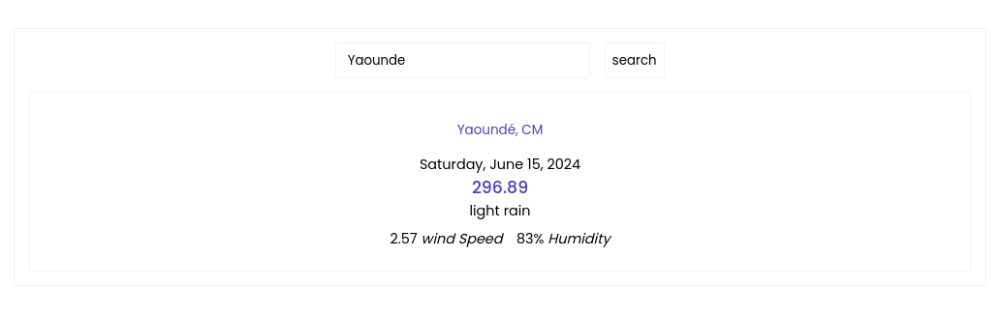

### build 25 React Project From Scrath to cover all the concepts of Programming in React Js

Hi, I'm vincent youmssi and I'm very Happy To start this serie of 25 small Projects to Master React Concepts. @mrvin100 👇

#### this is a 21th on 25 projects to build : 👉 Weather.App

✍ : Thank's FreeCodeCamp 🙏 this is an awesome project that use an Api On this website : https://openweathermap.org/. See you later for another adventure 🤝 !
